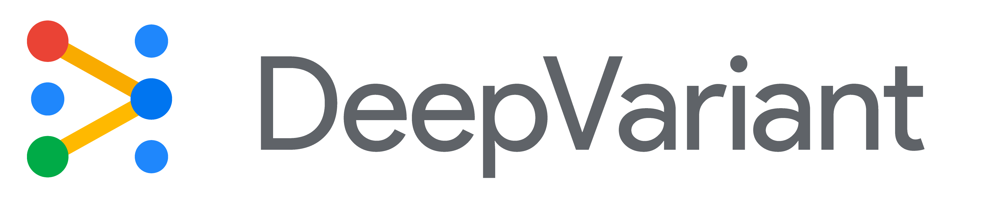

[](https://github.com/google/deepvariant/releases)
[](https://groups.google.com/d/forum/deepvariant-announcements)
[](https://goo.gl/deepvariant)

DeepVariant is a deep learning-based variant caller that takes aligned reads (in
BAM or CRAM format), produces pileup image tensors from them, classifies each
tensor using a convolutional neural network, and finally reports the results in
a standard VCF or gVCF file.

DeepVariant supports germline variant-calling in diploid organisms.

**DeepVariant case-studies for germline variant calling:**

*   NGS (Illumina or Element) data for either a
    [whole genome](docs/deepvariant-case-study.md) or
    [whole exome](docs/deepvariant-exome-case-study.md).
*   PacBio HiFi data
    [PacBio case study](docs/deepvariant-pacbio-model-case-study.md).
*   Oxford Nanopore R10.4.1
    [Simplex case study](docs/deepvariant-ont-r104-simplex-case-study.md).
*   Complete Genomics
    [T7 case study](docs/deepvariant-complete-t7-case-study.md);
    [G400 case study](docs/deepvariant-complete-g400-case-study.md).
*   Pangenome-mapping-based case-study:
    [vg case study](docs/deepvariant-vg-case-study.md).
*   RNA data for
    [PacBio Iso-Seq/MAS-Seq case study](docs/deepvariant-masseq-case-study.md)
    and [Illumina RNA-seq Case Study](docs/deepvariant-rnaseq-case-study.md).
*   Hybrid PacBio HiFi + Illumina WGS, see the
    [hybrid case study](docs/deepvariant-hybrid-case-study.md).

**Pangenome-aware DeepVariant case-studies:**

*   Pangenome-aware DeepVariant WGS (Illumina or Element):
    [Mapped with BWA](docs/pangenome-aware-wgs-bwa-case-study.md),
    [Mapped with VG](docs/pangenome-aware-wgs-vg-case-study.md).
*   Pangenome-aware DeepVariant WES (Illumina or Element):
    [Mapped with BWA](docs/pangenome-aware-wes-bwa-case-study.md).

We have also adapted DeepVariant for somatic calling. See the
[DeepSomatic](https://github.com/google/deepsomatic) repo for details.

Please also note:

*   DeepVariant currently supports variant calling on organisms where the
    ploidy/copy-number is two. This is because the genotypes supported are
    hom-alt, het, and hom-ref.
*   The models included with DeepVariant are only trained on human data. For
    other organisms, see the
    [blog post on non-human variant-calling](https://google.github.io/deepvariant/posts/2018-12-05-improved-non-human-variant-calling-using-species-specific-deepvariant-models/)
    for some possible pitfalls and how to handle them.

## DeepTrio

DeepTrio is a deep learning-based trio variant caller built on top of
DeepVariant. DeepTrio extends DeepVariant's functionality, allowing it to
utilize the power of neural networks to predict genomic variants in trios or
duos. See [this page](docs/deeptrio-details.md) for more details and
instructions on how to run DeepTrio.

DeepTrio supports germline variant-calling in diploid organisms for the
following types of input data:

*   NGS (Illumina) data for either
    [whole genome](docs/deeptrio-wgs-case-study.md) or whole exome.
*   PacBio HiFi data, see the
    [PacBio case study](docs/deeptrio-pacbio-case-study.md).

Please also note:

*   All DeepTrio models were trained on human data.
*   It is possible to use DeepTrio with only 2 samples (child, and one parent).
*   External tool [GLnexus](https://github.com/dnanexus-rnd/GLnexus) is used to
    merge output VCFs.

## How to run DeepVariant

We recommend using our Docker solution. The command will look like this:

```
BIN_VERSION="1.9.0"
docker run \
  -v "YOUR_INPUT_DIR":"/input" \
  -v "YOUR_OUTPUT_DIR:/output" \
  google/deepvariant:"${BIN_VERSION}" \
  /opt/deepvariant/bin/run_deepvariant \
  --model_type=WGS \ **Replace this string with exactly one of the following [WGS,WES,PACBIO,ONT_R104,HYBRID_PACBIO_ILLUMINA]**
  --ref=/input/YOUR_REF \
  --reads=/input/YOUR_BAM \
  --output_vcf=/output/YOUR_OUTPUT_VCF \
  --output_gvcf=/output/YOUR_OUTPUT_GVCF \
  --num_shards=$(nproc) \ **This will use all your cores to run make_examples. Feel free to change.**
  --vcf_stats_report=true \ **Optional. Creates VCF statistics report in html file. Default is false.
  --disable_small_model=true \ **Optional. Disables the small model from make_examples stage. Default is false.
  --logging_dir=/output/logs \ **Optional. This saves the log output for each stage separately.
  --haploid_contigs="chrX,chrY" \ **Optional. Heterozygous variants in these contigs will be re-genotyped as the most likely of reference or homozygous alternates. For a sample with karyotype XY, it should be set to "chrX,chrY" for GRCh38 and "X,Y" for GRCh37. For a sample with karyotype XX, this should not be used.
  --par_regions_bed="/input/GRCh3X_par.bed" \ **Optional. If --haploid_contigs is set, then this can be used to provide PAR regions to be excluded from genotype adjustment. Download links to this files are available in this page.
  --dry_run=false **Default is false. If set to true, commands will be printed out but not executed.
```

For details on X,Y support, please see
[DeepVariant haploid support](docs/deepvariant-haploid-support.md) and the case
study in
[DeepVariant X, Y case study](docs/deepvariant-xy-calling-case-study.md). You
can download the PAR bed files from here:
[GRCh38_par.bed](https://storage.googleapis.com/deepvariant/case-study-testdata/GRCh38_PAR.bed),
[GRCh37_par.bed](https://storage.googleapis.com/deepvariant/case-study-testdata/GRCh37_PAR.bed).

To see all flags you can use, run: `docker run
google/deepvariant:"${BIN_VERSION}"`

If you're using GPUs, or want to use Singularity instead, see
[Quick Start](docs/deepvariant-quick-start.md) for more details.

If you are running on a machine with a GPU, an experimental mode is available
that enables running the `make_examples` stage on the CPU while the
 `call_variants` stage runs on the GPU simultaneously.
For more details, refer to the [Fast Pipeline case study](docs/deepvariant-fast-pipeline-case-study.md).

For more information, also see:

*   [Full documentation list](docs/README.md)
*   [Detailed usage guide](docs/deepvariant-details.md) with more information on
    the input and output file formats and how to work with them.
*   [Best practices for multi-sample variant calling with DeepVariant](docs/trio-merge-case-study.md)
*   [(Advanced) Training tutorial](docs/deepvariant-training-case-study.md)
*   [DeepVariant's Frequently Asked Questions, FAQ](docs/FAQ.md)

## How to cite

If you're using DeepVariant in your work, please cite:

[A universal SNP and small-indel variant caller using deep neural networks. *Nature Biotechnology* 36, 983–987 (2018).](https://rdcu.be/7Dhl) <br/>
Ryan Poplin, Pi-Chuan Chang, David Alexander, Scott Schwartz, Thomas Colthurst, Alexander Ku, Dan Newburger, Jojo Dijamco, Nam Nguyen, Pegah T. Afshar, Sam S. Gross, Lizzie Dorfman, Cory Y. McLean, and Mark A. DePristo.<br/>
doi: https://doi.org/10.1038/nbt.4235

Additionally, if you are generating multi-sample calls using our
[DeepVariant and GLnexus Best Practices](docs/trio-merge-case-study.md), please
cite:

[Accurate, scalable cohort variant calls using DeepVariant and GLnexus.
_Bioinformatics_ (2021).](https://doi.org/10.1093/bioinformatics/btaa1081)<br/>
Taedong Yun, Helen Li, Pi-Chuan Chang, Michael F. Lin, Andrew Carroll, and Cory
Y. McLean.<br/>
doi: https://doi.org/10.1093/bioinformatics/btaa1081

## Why Use DeepVariant?

*   **High accuracy** - DeepVariant won 2020
    [PrecisionFDA Truth Challenge V2](https://precision.fda.gov/challenges/10/results)
    for All Benchmark Regions for ONT, PacBio, and Multiple Technologies
    categories, and 2016
    [PrecisionFDA Truth Challenge](https://precision.fda.gov/challenges/truth/results)
    for best SNP Performance. DeepVariant maintains high accuracy across data
    from different sequencing technologies, prep methods, and species. For
    [lower coverage](https://google.github.io/deepvariant/posts/2019-09-10-twenty-is-the-new-thirty-comparing-current-and-historical-wgs-accuracy-across-coverage/),
    using DeepVariant makes an especially great difference. See
    [metrics](docs/metrics.md) for the latest accuracy numbers on each of the
    sequencing types.
*   **Flexibility** - Out-of-the-box use for
    [PCR-positive](https://ai.googleblog.com/2018/04/deepvariant-accuracy-improvements-for.html)
    samples and
    [low quality sequencing runs](https://blog.dnanexus.com/2018-01-16-evaluating-the-performance-of-ngs-pipelines-on-noisy-wgs-data/),
    and easy adjustments for
    [different sequencing technologies](https://google.github.io/deepvariant/posts/2019-01-14-highly-accurate-snp-and-indel-calling-on-pacbio-ccs-with-deepvariant/)
    and
    [non-human species](https://google.github.io/deepvariant/posts/2018-12-05-improved-non-human-variant-calling-using-species-specific-deepvariant-models/).
*   **Ease of use** - No filtering is needed beyond setting your preferred
    minimum quality threshold.
*   **Cost effectiveness** - With a single non-preemptible n1-standard-16
    machine on Google Cloud, it costs ~$11.8 to call a 30x whole genome and
    ~$0.89 to call an exome. With preemptible pricing, the cost is $2.84 for a
    30x whole genome and $0.21 for whole exome (not considering preemption).
*   **Speed** - See [metrics](docs/metrics.md) for the runtime of all supported
    datatypes on a 96-core CPU-only machine</sup>. Multiple options for
    acceleration exist.
*   **Usage options** - DeepVariant can be run via Docker or binaries, using
    both on-premise hardware or in the cloud, with support for hardware
    accelerators like GPUs and TPUs.

<a name="myfootnote1">(1)</a>: Time estimates do not include mapping.

## How DeepVariant works


For more information on the pileup images and how to read them, please see the
["Looking through DeepVariant's Eyes" blog post](https://google.github.io/deepvariant/posts/2020-02-20-looking-through-deepvariants-eyes/).

DeepVariant relies on [Nucleus](https://github.com/google/nucleus), a library of
Python and C++ code for reading and writing data in common genomics file formats
(like SAM and VCF) designed for painless integration with the
[TensorFlow](https://www.tensorflow.org/) machine learning framework. Nucleus
was built with DeepVariant in mind and open-sourced separately so it can be used
by anyone in the genomics research community for other projects. See this blog
post on
[Using Nucleus and TensorFlow for DNA Sequencing Error Correction](https://google.github.io/deepvariant/posts/2019-01-31-using-nucleus-and-tensorflow-for-dna-sequencing-error-correction/).

## DeepVariant Setup

### Prerequisites

*   Unix-like operating system (cannot run on Windows)
*   Python 3.10

### Official Solutions

Below are the official solutions provided by the
[Genomics team in Google Health](https://health.google/health-research/).

Name                                                                                                | Description
:-------------------------------------------------------------------------------------------------: | -----------
[Docker](docs/deepvariant-quick-start.md)           | This is the recommended method.
[Build from source](docs/deepvariant-build-test.md) | DeepVariant comes with scripts to build it on Ubuntu 20.04. To build and run on other Unix-based systems, you will need to modify these scripts.
Prebuilt Binaries                                                                                   | Available at [`gs://deepvariant/`](https://console.cloud.google.com/storage/browser/deepvariant). These are compiled to use SSE4 and AVX instructions, so you will need a CPU (such as Intel Sandy Bridge) that supports them. You can check the `/proc/cpuinfo` file on your computer, which lists these features under "flags".

## Contribution Guidelines

Please [open a pull request](https://github.com/google/deepvariant/compare) if
you wish to contribute to DeepVariant. Note, we have not set up the
infrastructure to merge pull requests externally. If you agree, we will test and
submit the changes internally and mention your contributions in our
[release notes](https://github.com/google/deepvariant/releases). We apologize
for any inconvenience.

If you have any difficulty using DeepVariant, feel free to
[open an issue](https://github.com/google/deepvariant/issues/new). If you have
general questions not specific to DeepVariant, we recommend that you post on a
community discussion forum such as [BioStars](https://www.biostars.org/).

## License

[BSD-3-Clause license](LICENSE)

## Acknowledgements

DeepVariant happily makes use of many open source packages. We would like to
specifically call out a few key ones:

*   [Boost Graph Library](http://www.boost.org/doc/libs/1_65_1/libs/graph/doc/index.html)
*   [abseil-cpp](https://github.com/abseil/abseil-cpp) and
    [abseil-py](https://github.com/abseil/abseil-py)
*   [pybind11](https://github.com/pybind/pybind11)
*   [GNU Parallel](https://www.gnu.org/software/parallel/)
*   [htslib & samtools](http://www.htslib.org/)
*   [Nucleus](https://github.com/google/nucleus)
*   [numpy](http://www.numpy.org/)
*   [SSW Library](https://github.com/mengyao/Complete-Striped-Smith-Waterman-Library)
*   [TensorFlow](https://www.tensorflow.org/)

We thank all of the developers and contributors to these packages for their
work.

## Disclaimer

This is not an official Google product.

NOTE: the content of this research code repository (i) is not intended to be a
medical device; and (ii) is not intended for clinical use of any kind, including
but not limited to diagnosis or prognosis.
