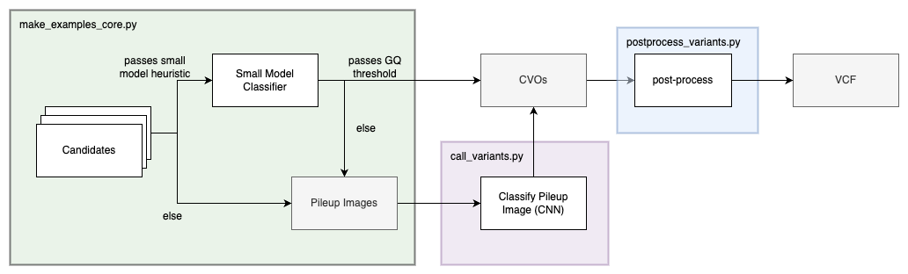
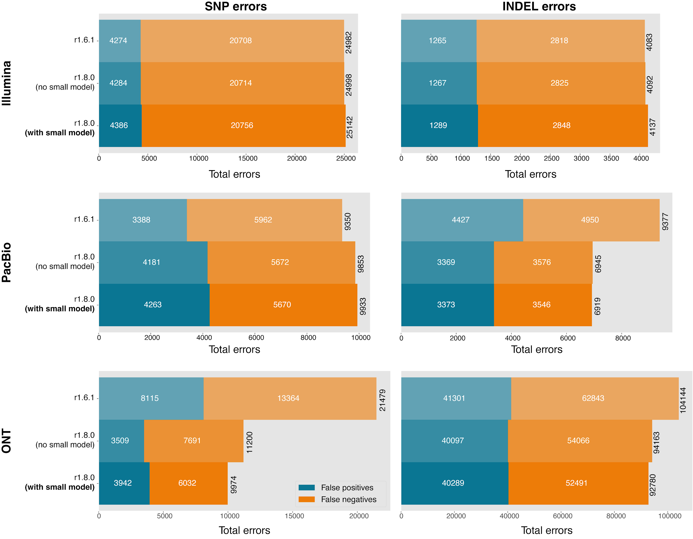
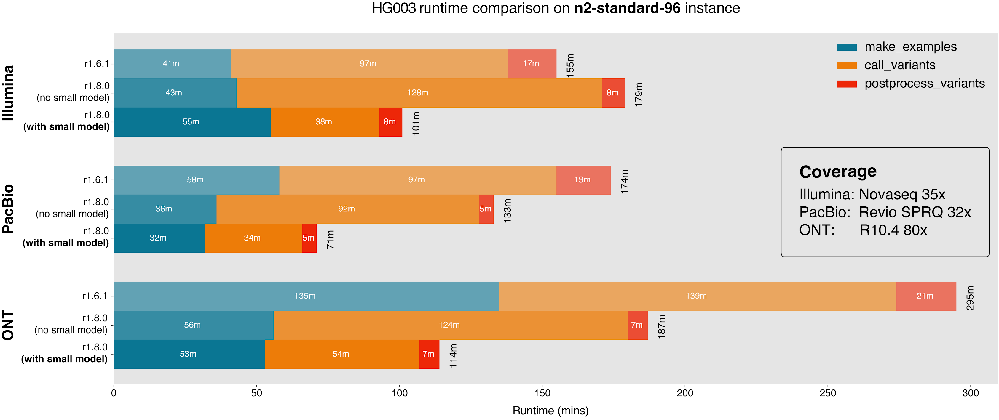
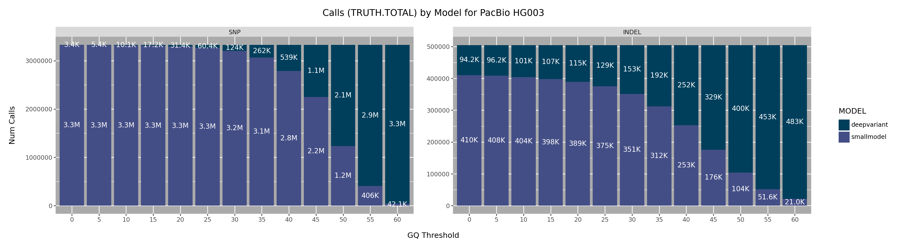
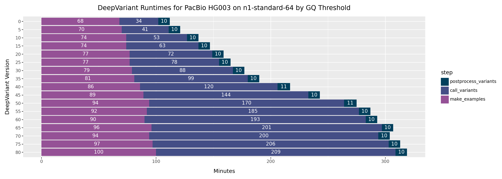

# Small model for DeepVariant

DeepVariant performs variant calling by way of image classification. Sequenced
reads are read from `.bam` files, marshalled into pileup images that encode a
variety of read and variant information and written out as image-like tensors.
These images are fed to a convolutional neural network (CNN) for classification.

This approach achieves state-of-the-art accuracy. In an effort to speed up
DeepVariant, version `1.8.0` introduces a second, light-weight multilayer
perceptron (MLP) that provides an initial genotype classification for all
biallelic variants before pileup images are generated.

When this small model is sufficiently confident in its classification—i.e. the
phred-scaled class probability (`GQ`) is above a set threshold set as an input
parameter—the genotype for that putative variant is accepted. If the `GQ` value
does not pass the threshold, the candidate continues through the regular
image-classification pipeline, i.e. the candidate is converted to a pileup image
and classified by the CNN during `call_variants`.

## Details on the small model

The "small model" is a simple, fully-connected MLP with two hidden layers. It
has roughly ~360k parameters, considerably fewer than the CNN's 82M. It accepts
a feature vector for each putative variant containing allele frequency, base-
and mapping quality, variant- and haplotype information, as well as allele
frequencies of adjacent positions.

The small model is called during the `make_examples` step, after candidate
sweeping but before pileup image generation. This way we avoid generating pileup
images for candidates we have already classified. If the small model
classification is accepted, `make_examples` writes them to disk as
[CallVariantsOutput](https://github.com/google/deepvariant/blob/r1.8/deepvariant/protos/deepvariant.proto#L328-L333)
protos, which are then consumed by `postprocess_variants` alongside the CVOs
from `call_variants`.

<figure class="image">
  
  <figcaption><b>Fig 1:</b> The small model is invoked during make_examples before pileup image generation, writing CVO protos that are consumed by postprocess_variants.</figcaption>
</figure>

### Model Features

The following table breaks up the feature vector of a single candidate locus.

identifying features | &nbsp; | &nbsp; | &nbsp; | &nbsp; | allele features            | &nbsp; | &nbsp; | &nbsp; | &nbsp; | variant features | &nbsp; | &nbsp; | &nbsp; | &nbsp; | allele context features             | &nbsp; |     |
-------------------- | ------ | ------ | ------ | ------ | -------------------------- | ------ | ------ | ------ | ------ | ---------------- | ------ | ------ | ------ | ------ | ----------------------------------- | ------ | ---
contig               | chr20  | &nbsp; | &nbsp; | &nbsp; | num_reads_supports_ref     | 20     | &nbsp; | &nbsp; | &nbsp; | is_snp           | 1      | &nbsp; | &nbsp; | &nbsp; | variant_allele_frequency_at_minus_4 | 0      | &nbsp;
start                | 101370 | &nbsp; | &nbsp; | &nbsp; | num_reads_supports_alt_1   | 21     | &nbsp; | &nbsp; | &nbsp; | is_insertion     | 0      | &nbsp; | &nbsp; | &nbsp; | variant_allele_frequency_at_minus_3 | 0      | &nbsp;
end                  | 101371 | &nbsp; | &nbsp; | &nbsp; | total_depth                | 41     | &nbsp; | &nbsp; | &nbsp; | is_deletion      | 0      | &nbsp; | &nbsp; | &nbsp; | variant_allele_frequency_at_minus_2 | 0      | &nbsp;
ref                  | T      | &nbsp; | &nbsp; | &nbsp; | variant_allele_frequency_1 | 51     | &nbsp; | &nbsp; | &nbsp; | insertion_length | 0      | &nbsp; | &nbsp; | &nbsp; | variant_allele_frequency_at_minus_1 | 2      | &nbsp;
alt_1                | C      | &nbsp; | &nbsp; | &nbsp; | ref_mapping_quality        | 60     | &nbsp; | &nbsp; | &nbsp; | deletion_length  | 0      | &nbsp; | &nbsp; | &nbsp; | variant_allele_frequency_at_plus_0  | 51     | &nbsp;
genotype             | 1      | &nbsp; | &nbsp; | &nbsp; | alt_1_mapping_quality      | 60     | &nbsp; | &nbsp; | &nbsp; | &nbsp;           | &nbsp; | &nbsp; | &nbsp; | &nbsp; | variant_allele_frequency_at_plus_1  | 2      | &nbsp;
&nbsp;               | &nbsp; | &nbsp; | &nbsp; | &nbsp; | ref_base_quality           | 88     | &nbsp; | &nbsp; | &nbsp; | &nbsp;           | &nbsp; | &nbsp; | &nbsp; | &nbsp; | variant_allele_frequency_at_plus_2  | 0      | &nbsp;
&nbsp;               | &nbsp; | &nbsp; | &nbsp; | &nbsp; | alt_1_base_quality         | 80     | &nbsp; | &nbsp; | &nbsp; | &nbsp;           | &nbsp; | &nbsp; | &nbsp; | &nbsp; | variant_allele_frequency_at_plus_3  | 2      | &nbsp;
&nbsp;               | &nbsp; | &nbsp; | &nbsp; | &nbsp; | ref_reverse_strand_ratio   | 0      | &nbsp; | &nbsp; | &nbsp; | &nbsp;           | &nbsp; | &nbsp; | &nbsp; | &nbsp; | variant_allele_frequency_at_plus_4  | 0      | &nbsp;
&nbsp;               | &nbsp; | &nbsp; | &nbsp; | &nbsp; | alt_1_reverse_strand_ratio | 0      | &nbsp; | &nbsp; | &nbsp; | &nbsp;           | &nbsp; | &nbsp; | &nbsp; | &nbsp; | &nbsp;                              | &nbsp; | &nbsp;

<figure class="image">
  <figcaption><b>Table 1:</b> An example feature vector for the small model for WGS. The <b>identifying features</b> such as contig, position, etc. are not passed to the model. Additionally, for long-read sequencing platforms such as PacBio and ONT, the <b>allele features</b> are computed per each haplotype (0,1,2) provided phasing information is available, thereby adding 30 more features. The <b>variant features</b> provide information on what type of variant this candidate represents. Finally, the default range for the <b>allele context features</b> from -25 to +25; for brevity, we show just -4 to +4.</figcaption>
</figure>

The set of features named `variant_allele_frequency_at_X` provide the model with
allele information of the surrounding environment of each candidate locus. The
model may adjust its classification probabilities if the candidate is in a
region of high variant density and is surrounded by many other putative
variants. These sites are generally very difficult to call, and the small model
has learned to be less confident in these regions.

## Accuracy numbers

<figure class="image">
  
  <figcaption><b>Fig 2:</b> Accuracy numbers by sequencing platform for HG003.</figcaption>
</figure>

## Runtime Improvements

As stated previously, the main motivation of the small model is to reduce
runtime while minimizing degradation in accuracy.

<figure class="image">
  
  <figcaption><b>Fig 3:</b> Runtime by sequencing platform</figcaption>
</figure>

### Runtime vs Number of calls made per model

The small model effects the total runtime in multiple ways:

*   An added classification computation occurs during `make_examples`. This
    exerts an additive effect on runtime.
*   All candidate variants the small model classifies successfully, i.e. with
    sufficient confidence, no longer need to be converted to pileup images
    during `make_examples`. This has a reductive effect on runtime.
*   `call_variants` scales more or less linearly with the number of examples
    needing to be classified. Since the small model reduces the number of pileup
    images, this strongly reduces the `call_variants` runtime.

The `GQ` threshold determines the level of confidence we require from the small
model before accepting its classification. As a result, the runtime scales with
this threshold: for higher `GQ` thresholds, fewer classifications are accepted
and more candidates are classified by the CNN. This is shown clearly in Figure
5.

<figure class="image">
  
  
  <figcaption><b>Fig 4:</b> The number of variants called by which model (top) and the resulting total runtime (bottom) by GQ threshold for PacBio HG003.</figcaption>
</figure>

## How to change default values or turn it off

The behavior of the small model is fully customizable:

*   `--disable_small_model` will disable the small model entirely and therefore
    skip the small model feature vector generation and classification.

*   `--make_examples_extra_args "small_model_snp_gq_threshold=<VALUE>"`:
    Specifies the GQ thresholds for SNPs. Setting it to `-1` disables all SNPs
    to be called by the small model.

*   `--make_examples_extra_args "small_model_indel_gq_threshold=<VALUE>"`:
    Specifies the GQ thresholds for INDELs. Setting it to `-1` disabled all
    INDELs to be called by the small model.

## What about multi-allelic variants?

The small model in `1.8.0` release does not consider multi-allelic variants, due
to the inherent complexity of classifying these sites. This may change in the
future.
