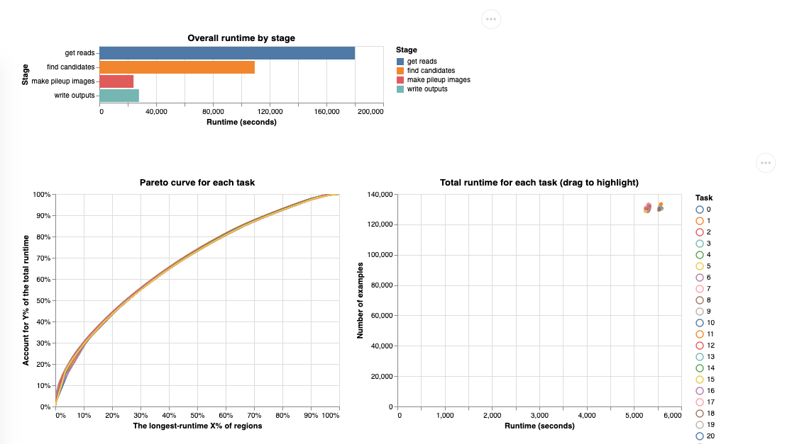

# Runtime by region profiling for make_examples

Starting in Deepvariant v1.1, make_examples has an optional parameter called
`--runtime_by_region`, which enables make_examples to output the runtime for
each region, broken up into the different stages of processing each region: "get
reads", "find candidates", "make pileup images", and "write outputs". These
stats, along with the number of reads, candidates, and examples processed for
each region, are output into a tab-separated value (TSV) file, or one TSV file
per task if the examples are sharded.

This TSV file can then be visualized using the `runtime_by_region_vis` script,
creating a visual report.



Example reports for typical runs:

*   [WGS](https://storage.googleapis.com/deepvariant/example-reports/runtime_report_wgs.html)
*   [WES](https://storage.googleapis.com/deepvariant/example-reports/runtime_report_wes.html)
*   [PacBio](https://storage.googleapis.com/deepvariant/example-reports/runtime_report_pacbio.html)
*   [Hybrid](https://storage.googleapis.com/deepvariant/example-reports/runtime_report_hybrid.html)

## How to enable runtime profiling during a DeepVariant run

### Using the run_deepvariant script

When using the one-step `run_deepvariant` script, supply a `--logging_dir`
directory and set `--runtime_report`. For example, when following the
[quick start](deepvariant-quick-start.md), including `--runtime_report
--logging_dir=/output/logs` would produce the following runtime profiling output
file and visual report:

```
/output/logs/make_examples_runtime_by_region/make_examples_runtime-00000-of-00001.tsv
/output/logs/make_examples_runtime_by_region_report.html
```

### Running stages individually

If you are using make_examples itself without the run_deepvariant script, supply
make_examples with `--runtime_by_region=` a filename (.tsv). If the examples are
sharded then the runtime profile should be sharded into the same number of
shards, e.g. when using `examples@64` then runtimes could be `runtimes@64.tsv`.

Then use the `runtime_by_region_vis` script to create a visual report of the
make_examples runtime by region data. Continuing from the quick start, it looks
like this:

```bash
BIN_VERSION="1.6.1" # Only available in v1.1+.
docker run \
  -v "INPUT_DIR":"/input" \
  -v "OUTPUT_DIR:/output" \
  google/deepvariant:"${BIN_VERSION}" \
  /opt/deepvariant/bin/runtime_by_region_vis  \
    --input=/output/logs/make_examples_runtime_by_region/make_examples_runtime-00000-of-00001.tsv \
    --output=/output/logs/make_examples_runtime_by_region/make_examples_runtime_vis.html \
    --title="Quick start runtime profiling"
```

## Interpreting the runtime report

### Where the data comes from

`make_examples`, the first stage of DeepVariant, starts from a BAM file and
corresponding reference FASTA file. One 1000 bp region at a time (set by
`--partition_size`), `make_examples` will:

1.  Get reads: Query the bam files for all the reads in the region. Optionally
    (`--realign_reads`) do a local assembly of the reads and realign the reads
    to the resulting haplotype graph.

2.  Find candidates: Catalogue all the putative alternate alleles for all those
    reads, and compare the accumulated evidence for each alt against thresholds
    (see `--vsc_min*` parameters for the thresholds).

3.  Make pileup images: Represent the reads as a
    [pileup image tensor](https://google.github.io/deepvariant/posts/2020-02-20-looking-through-deepvariants-eyes/).
    When `--alt_aligned_pileup` is enabled, those alignments are included in
    this step.

4.  Write output: Write the examples composed of candidates and pileup images
    out to a tfrecord file.

This is the top of one example file (tab-delimited but shown nicely spaced here
for readability):

```
region              get reads  find candidates  make pileup images  write outputs  num reads  num candidates  num examples
chr1:1-1000         0.025      0.016            0.0                 0.0            0          0               0
chr1:64001-65000    0.032      0.044            0.027               0.001          25         1               1
chr1:128001-129000  0.059      0.047            0.081               0.01           59         2               2
chr1:192001-193000  0.058      0.045            0.261               0.078          56         13              13
...
```

The runtimes for the four stages are all captured in **seconds**.

### Interpreting the charts

All the charts are built from the same types of data as shown above. Here "task"
will refer to the runtimes captured when producing one shard of examples. For
example, if there are 64 shards, task 1 is the task that produced
`examples-00001-of-00064.tfrecord.gz`.

1.  "Overall runtime by stage": Total runtime across all regions and all tasks.
2.  "Pareto curve for each task": Each task is treated separately here. For the
    Pareto curve, the regions are sorted by longest total runtime (sum of the
    four stages) and ordered from left to right, longest runtime to shortest
    runtime. These are shown as a percentage of all regions. The cumulative
    runtime is shown on the y-axis, as a percentage of the total runtime for the
    given task. If all regions had the same runtime, the curve would be a
    straight diagonal line. The extent to which the curve bends to the upper
    left corner shows how much some regions take disproportionately longer than
    others. Hover the cursor over the lines to see the exact percentages.
3.  "Total runtime for each task": Each point is a task. Hover over each point
    to see the runtime calculated into hours, minutes, and seconds. Drag a
    rectangle around some of the tasks to see them highlighted in the Pareto
    curve. Often the tasks with longer runtimes in the chart will be the same
    tasks with Pareto curves leaning to the upper left, indicating that for
    tasks than run longer than others, the cause is with a subset of the regions
    not with an overall slowdown of all regions.
4.  "Stage runtimes for each task": A histogram of how long each stage takes for
    the different tasks. Often the `make pileup images` stage will show more
    variability here than other stages.
5.  "Top runtime regions" and "Median runtime regions": This shows some
    individual regions to give more context for some of the trends seen in other
    charts. Pay attention especially to the differences between the y-axis
    limits in these two charts. The long-running regions are often taking
    hundreds of times longer than median regions, with the runtime also taken up
    by different stages.
6.  "The longest-running regions that produced no examples": This profiles some
    individual regions that yielded zero output examples. Also look at the
    subtitle to see what percentage of the total runtime is taken up by
    processing these zero-example regions.
7.  "Runtime by stage for ...": When there are more than 5000 regions, there
    will be two charts here, one for the bottom 99% of regions and one for the
    top 100 regions (both by total runtime). If fewer than 5000 regions, there
    will only be one chart showing all the regions. This is similar to the
    "Stage runtimes for each task" except that regions are shown individually
    here instead of being combined into tasks. This shows the spread of runtimes
    across regions for the different stages.
8.  "Trends for ...": This is in one or two sets of charts by the same logic as
    the "Runtime by stage" charts. This shows a grid of charts intersecting
    counts of reads, candidates, and examples (rows) with the runtime for the
    four stages (columns) in seconds. It is common that some of these runtimes
    will correlate nicely with the counts. For example, the `write outputs`
    runtime is closely tied to the number of examples, which is not surprising.
