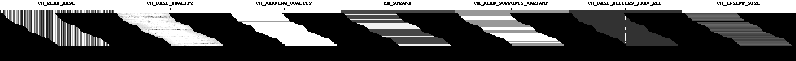

# show_examples: Saving human-readable images from DeepVariant examples

This is a short guide to using the show_examples tool to view the pileup images
used within DeepVariant and save them as PNG image files. This tool is
particularly useful when you want to try to understand how a candidate variant
of interest was represented when it was passed into the neural network.



This example was generated with the data from the
[quick start guide](deepvariant-quick-start.md) and the example commands below.

For more information on the pileup images and how to read them, please see the
["Looking through DeepVariant's Eyes" blog post](https://google.github.io/deepvariant/posts/2020-02-20-looking-through-deepvariants-eyes/).

The `show_examples` tool is introduced in DeepVariant 1.0.0, so it is not
available in older versions, but it will work with make_examples output files
from older versions of DeepVariant.

## Finding the make_examples output tfrecord files

First, find the make_examples.tfrecord.gz files output by DeepVariant during the
make_examples (first) stage.

If you followed along with the [quick start guide](deepvariant-quick-start.md)
and case studies that used the Docker version, then these files are usually
hidden inside the Docker container. But you can get them exported into the same
output directory where the VCF file appears by adding the following setting in
the `run_deepvariant` command.

```bash
# Add the following to your run_deepvariant command.
--intermediate_results_dir=/output/
```

Then the make_examples file should appear in the directory docker mounted as
`/output/`. For example, if you followed the
[quick-start documentation](deepvariant-quick-start.md), it looks like this:
`${OUTPUT_DIR}/make_examples.tfrecord-00000-of-00001.gz`.

## Running show_examples

Once you have a make_examples output tfrecord file, then you can run
`show_examples` to see the pileup images inside:

```bash
# Continuing from the quick start linked above:
INPUT_DIR="${PWD}/quickstart-testdata"
OUTPUT_DIR="${PWD}/quickstart-output"

BIN_VERSION="1.7.0"  # show_examples is available only in version 1.0.0 and later.
sudo docker run \
  -v "${INPUT_DIR}":"/input" \
  -v "${OUTPUT_DIR}":"/output" \
  google/deepvariant:"${BIN_VERSION}" /opt/deepvariant/bin/show_examples \
  --examples=/output/intermediate_results_dir/make_examples.tfrecord-00000-of-00001.gz \
  --example_info_json=/output/intermediate_results_dir/make_examples.tfrecord-00000-of-00001.gz.example_info.json \
  --output=/output/pileup \
  --num_records=20 \
  --curate

# And then your images are here:
ls "${OUTPUT_DIR}"/pileup*.png
```

## Try it with these powerful optional parameters

*   Filter to regions? Use e.g. `--regions chr20:1-3000000` or paths to BED or
    BEDPE files.
*   Filter to records from a VCF? Use `--vcf variants.vcf`. This can be a piece
    of a VCF, e.g. grepping a hap.py output VCF for false positives. This is a
    powerful way to pick out variants of interest and investigate them in more
    depth.
*   Stop after a certain number of examples, e.g. 10? Use `--num_records 10`.
*   Sharded examples? Use for example, `--examples make_examples.tfrecord@64.gz`
    to search through them all. This is best paired with `--regions` or `--vcf`
    to narrow down to a small number of examples of interest. You can also use
    the actual filename of a single make_examples file to only read that one, as
    shown in the sample code above.
*   Use `--curate` to create a TSV file with concepts for each pileup. Then
    filter that TSV in any way you want and read that filtered TSV in using
    `--filter_by_tsv` to e.g. get pileup images only for examples with low
    mapping quality, many errors, nearby variants, or any other concepts.
    Filtering can be done any way you want, `grep` would be an easy option (the
    TSV's header is not needed).
*   Write out example tfrecords using `--write_tfrecords` after applying any
    filtering using the options above.
